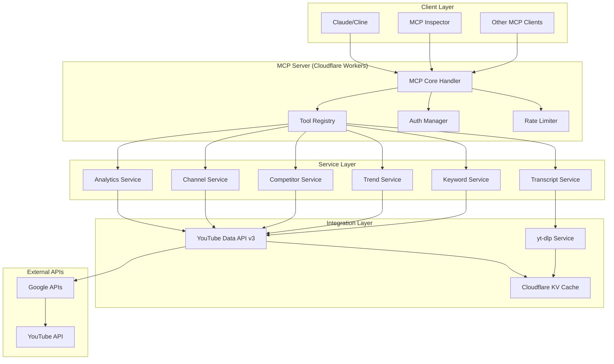
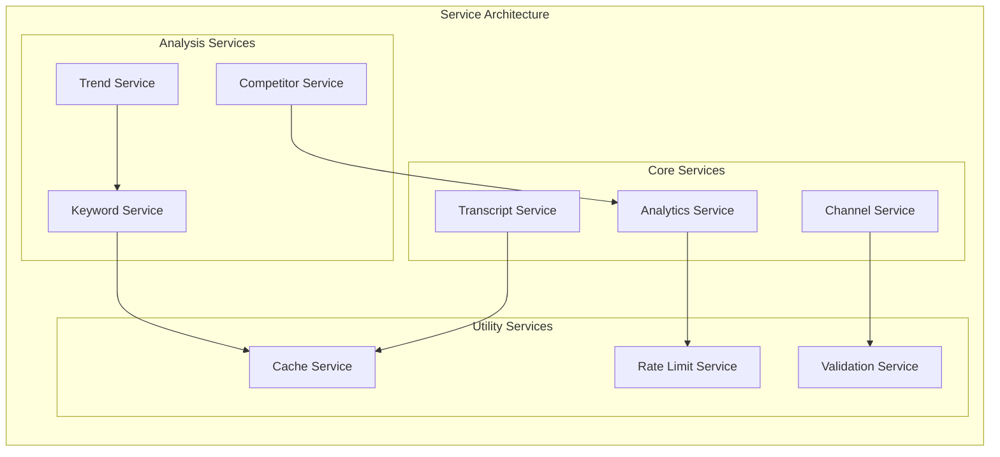
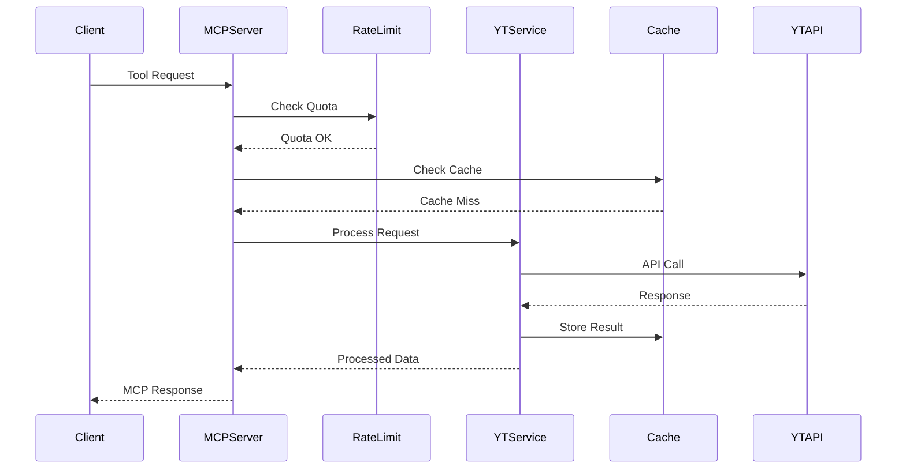
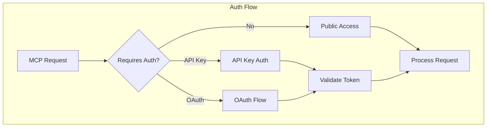
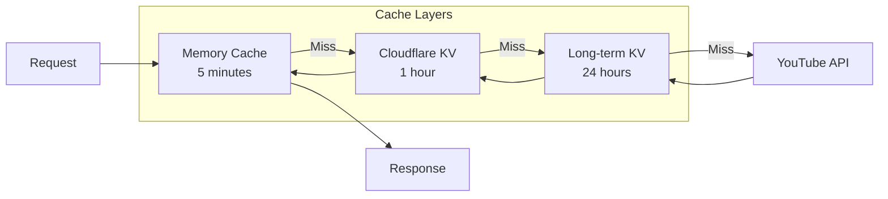

# YouTube Scraping MCP Server - Comprehensive Architectural Plan

**Project**: YouTube Scraping MCP Server  
**Date**: December 6, 2024  
**Version**: 1.0  
**Confidence Rating**: 9/10

## Executive Summary

This document outlines the comprehensive architectural plan for building a production-ready YouTube Scraping MCP Server based on the Model Context Protocol patterns learned from Cloudflare's implementation. The server will provide YouTube analytics, transcript extraction, channel analysis, and trend detection capabilities through a robust, scalable architecture deployed on Cloudflare Workers.

## 1. System Architecture Overview



## 2. MCP Tools Definition

### Core Tools Schema

```typescript
interface MCPToolDefinition {
  name: string;
  description: string;
  inputSchema: JSONSchema;
  outputSchema: JSONSchema;
  requiresAuth: boolean;
  quotaCost: number;
}
```

### Tool Catalog

| Tool Name | Description | Auth Required | Quota Cost | Input Schema |
|-----------|-------------|---------------|------------|--------------|
| `getVideoTranscript` | Extract transcript from YouTube video | No | 0 | `{videoId: string, language?: string}` |
| `getVideoAnalytics` | Get video metrics and statistics | No | 1 | `{videoId: string, metrics?: string[]}` |
| `analyzeChannelPerformance` | Analyze last 10 videos from channel | No | 10 | `{channelId: string, videoCount?: number}` |
| `findTopPerformingVideo` | Identify highest performing video with rationale | No | 10 | `{channelId: string, metrics: string[]}` |
| `compareWithCompetitors` | Compare channel with competitor analysis | No | 30 | `{channelId: string, competitorIds: string[]}` |
| `searchKeywordsInContent` | Search for keywords in video content | No | 5 | `{query: string, channelId?: string, maxResults?: number}` |
| `detectTrendingTopics` | Identify trending topics and keywords | No | 20 | `{category?: string, region?: string, timeframe?: string}` |

## 3. Service Layer Design



## 4. Data Models & TypeScript Interfaces

### Core Data Models

```typescript
// Base types
interface VideoMetrics {
  viewCount: number;
  likeCount: number;
  commentCount: number;
  subscriberCount: number;
  publishedAt: string;
  duration: string;
}

interface VideoInfo {
  videoId: string;
  title: string;
  description: string;
  channelId: string;
  channelTitle: string;
  metrics: VideoMetrics;
  tags: string[];
  categoryId: string;
}

interface TranscriptSegment {
  text: string;
  start: number;
  duration: number;
}

interface VideoTranscript {
  videoId: string;
  language: string;
  segments: TranscriptSegment[];
  fullText: string;
}

interface ChannelAnalysis {
  channelId: string;
  channelTitle: string;
  videos: VideoInfo[];
  topPerformer: {
    video: VideoInfo;
    reasons: string[];
    performanceScore: number;
  };
  averageMetrics: VideoMetrics;
  trends: {
    topicTrends: string[];
    performancePatterns: string[];
  };
}

interface CompetitorComparison {
  mainChannel: ChannelAnalysis;
  competitors: ChannelAnalysis[];
  insights: {
    strengths: string[];
    weaknesses: string[];
    opportunities: string[];
    recommendations: string[];
  };
}

interface TrendAnalysis {
  trendingTopics: Array<{
    topic: string;
    score: number;
    growth: number;
    relatedKeywords: string[];
  }>;
  timeframe: string;
  region: string;
  category: string;
}
```

### API Response Models

```typescript
interface MCPToolResponse<T = unknown> {
  success: boolean;
  data?: T;
  error?: {
    code: string;
    message: string;
    details?: unknown;
  };
  metadata?: {
    quotaUsed: number;
    cacheHit: boolean;
    processingTime: number;
  };
}
```

## 5. API Integration Strategy

### YouTube Data API Integration



### yt-dlp Integration Strategy

```typescript
interface YTDLPConfig {
  extractInfo: boolean;
  writeSubtitles: boolean;
  writeAutoSubs: boolean;
  subtitlesLangs: string[];
  format: string;
  ignoreerrors: boolean;
}

interface YTDLPService {
  extractTranscript(videoId: string, options?: YTDLPConfig): Promise<VideoTranscript>;
  getVideoInfo(videoId: string): Promise<VideoInfo>;
  validateVideoAccess(videoId: string): Promise<boolean>;
}
```

## 6. Authentication & Security Architecture

### Hybrid Authentication Strategy



### Security Configuration

```typescript
interface SecurityConfig {
  apiKeys: {
    youtube: string;
    fallbackKeys?: string[];
  };
  oauth: {
    clientId: string;
    clientSecret: string;
    redirectUri: string;
    scopes: string[];
  };
  rateLimiting: {
    dailyQuota: number;
    requestsPerMinute: number;
    burstLimit: number;
  };
  allowedOrigins: string[];
  corsEnabled: boolean;
}
```

## 7. Deployment Strategy (Cloudflare Workers)

### Project Structure

```
youtube-scraping-mcp/
├── src/
│   ├── controllers/
│   │   ├── mcp.controller.ts
│   │   ├── auth.controller.ts
│   │   └── tools.controller.ts
│   ├── services/
│   │   ├── transcript.service.ts
│   │   ├── analytics.service.ts
│   │   ├── channel.service.ts
│   │   ├── competitor.service.ts
│   │   ├── trend.service.ts
│   │   └── keyword.service.ts
│   ├── utils/
│   │   ├── rate-limiter.util.ts
│   │   ├── cache.util.ts
│   │   ├── validator.util.ts
│   │   └── error-handler.util.ts
│   ├── types/
│   │   ├── mcp.types.ts
│   │   ├── youtube.types.ts
│   │   └── api.types.ts
│   ├── middleware/
│   │   ├── auth.middleware.ts
│   │   ├── rate-limit.middleware.ts
│   │   └── cors.middleware.ts
│   └── index.ts
├── wrangler.toml
├── package.json
├── tsconfig.json
└── README.md
```

### Cloudflare Workers Configuration

```toml
# wrangler.toml
name = "youtube-scraping-mcp"
main = "src/index.ts"
compatibility_date = "2024-01-01"

[env.production]
vars = { ENVIRONMENT = "production" }

[env.development]
vars = { ENVIRONMENT = "development" }

[[kv_namespaces]]
binding = "CACHE"
id = "your-kv-namespace-id"

[vars]
YOUTUBE_API_KEY = "your-api-key"
OAUTH_CLIENT_ID = "your-oauth-client-id"
```

## 8. Error Handling & Resilience

### Error Handling Strategy

```typescript
enum ErrorCodes {
  QUOTA_EXCEEDED = 'QUOTA_EXCEEDED',
  INVALID_VIDEO_ID = 'INVALID_VIDEO_ID',
  TRANSCRIPT_NOT_AVAILABLE = 'TRANSCRIPT_NOT_AVAILABLE',
  API_RATE_LIMITED = 'API_RATE_LIMITED',
  AUTHENTICATION_FAILED = 'AUTHENTICATION_FAILED',
  INTERNAL_ERROR = 'INTERNAL_ERROR'
}

interface ErrorHandler {
  handleQuotaExceeded(): MCPToolResponse;
  handleRateLimit(retryAfter: number): MCPToolResponse;
  handleAPIError(error: unknown): MCPToolResponse;
  handleValidationError(details: string[]): MCPToolResponse;
}
```

### Exponential Backoff Implementation

```typescript
interface RetryConfig {
  maxRetries: number;
  baseDelay: number;
  maxDelay: number;
  backoffFactor: number;
}

class ExponentialBackoff {
  async executeWithRetry<T>(
    operation: () => Promise<T>,
    config: RetryConfig
  ): Promise<T>;
}
```

## 9. Performance Optimization

### Caching Strategy



### Cache Configuration

```typescript
interface CacheConfig {
  transcripts: { ttl: 86400 }; // 24 hours
  videoMetrics: { ttl: 3600 }; // 1 hour
  channelAnalysis: { ttl: 7200 }; // 2 hours
  trends: { ttl: 1800 }; // 30 minutes
}
```

### Rate Limiting Strategy

- **YouTube Data API v3 Quota**: 10,000 units/day
- **Rate Limiting**: Exponential backoff retry strategy
- **Request throttling**: 1 request/second to avoid hitting limits
- **Quota monitoring**: Real-time tracking of quota usage

## 10. Testing Strategy

### MCP Inspector Integration

```typescript
interface TestSuite {
  unitTests: {
    services: string[];
    utils: string[];
    middleware: string[];
  };
  integrationTests: {
    mcpTools: string[];
    apiIntegrations: string[];
  };
  e2eTests: {
    mcpInspector: string[];
    clientIntegration: string[];
  };
}
```

### Test Configuration

```typescript
interface TestConfig {
  mockYouTubeAPI: boolean;
  testVideoIds: string[];
  testChannelIds: string[];
  quotaTestMode: boolean;
}
```

## 11. Implementation Phases

### Phase 1: Core Infrastructure (Week 1-2)
- Set up Cloudflare Workers project structure
- Implement MCP core handler and tool registry
- Basic authentication and rate limiting
- Basic error handling and logging

### Phase 2: Basic Tools (Week 3-4)
- Implement `getVideoTranscript` tool with yt-dlp
- Implement `getVideoAnalytics` tool with YouTube API
- Basic caching with Cloudflare KV
- MCP Inspector testing integration

### Phase 3: Analysis Tools (Week 5-6)
- Implement `analyzeChannelPerformance` tool
- Implement `findTopPerformingVideo` with AI analysis
- Add performance metrics and optimization

### Phase 4: Advanced Analytics (Week 7-8)
- Implement `compareWithCompetitors` tool
- Implement `searchKeywordsInContent` tool
- Advanced caching strategies

### Phase 5: Trend Analysis (Week 9-10)
- Implement `detectTrendingTopics` tool
- AI-powered trend analysis
- Performance optimization and scaling

### Phase 6: Production Hardening (Week 11-12)
- Comprehensive error handling
- Security audit and hardening
- Documentation and deployment guides
- Load testing and optimization

## 12. File Structure Implementation

```
src/
├── controllers/
│   ├── mcp.controller.ts           # Main MCP request handler
│   ├── auth.controller.ts          # Authentication logic
│   └── tools.controller.ts         # Tool execution coordinator
├── services/
│   ├── transcript.service.ts       # yt-dlp integration
│   ├── analytics.service.ts        # YouTube API analytics
│   ├── channel.service.ts          # Channel analysis
│   ├── competitor.service.ts       # Competitor comparison
│   ├── trend.service.ts           # Trend detection
│   └── keyword.service.ts         # Keyword analysis
├── utils/
│   ├── rate-limiter.util.ts       # Quota management
│   ├── cache.util.ts              # Caching operations
│   ├── validator.util.ts          # Input validation
│   └── error-handler.util.ts      # Error management
├── types/
│   ├── mcp.types.ts               # MCP-specific types
│   ├── youtube.types.ts           # YouTube API types
│   └── api.types.ts               # General API types
├── middleware/
│   ├── auth.middleware.ts         # Authentication middleware
│   ├── rate-limit.middleware.ts   # Rate limiting middleware
│   └── cors.middleware.ts         # CORS handling
└── index.ts                       # Main entry point
```

## 13. Technical Requirements Summary

### Core Requirements
- **Language**: TypeScript with strong typing (no `any`, `unknown`, `undefined`)
- **Platform**: Cloudflare Workers for edge computing
- **APIs**: YouTube Data API v3, yt-dlp for transcript extraction
- **Authentication**: Hybrid (API key + OAuth) with user-based access control
- **Caching**: Multi-layer caching with Cloudflare KV
- **Rate Limiting**: Exponential backoff with 10,000 units/day quota

### Architecture Principles
- Modular service-oriented architecture
- Strong TypeScript typing throughout
- Comprehensive error handling and resilience
- Performance optimization with edge computing
- Scalable and maintainable code structure
- MCP Inspector integration for testing

## 14. Success Metrics

- **Performance**: < 500ms response time for cached requests
- **Reliability**: 99.9% uptime with proper error handling
- **Scalability**: Handle 1000+ requests/hour within quota limits
- **Maintainability**: Modular architecture with clear separation of concerns
- **Usability**: Comprehensive MCP tool integration with Claude/Cline

---

**Next Steps**: This architectural plan is ready for implementation. The recommended approach is to proceed with Phase 1 (Core Infrastructure) to establish the foundation, then iteratively build the tools and services according to the phased implementation schedule.

**Confidence Rating**: 9/10 - This plan leverages proven MCP patterns from Cloudflare's implementation while addressing all specified YouTube scraping requirements with a robust, scalable architecture.